## This page provides the details of work done for ASR in 2021
- **Problem** - Description of innovation in ASR/NLP domain (2024)
- **Research Questions** - Description of innovation in ASR/NLP domain (2024)

## ASR 2021 Paper

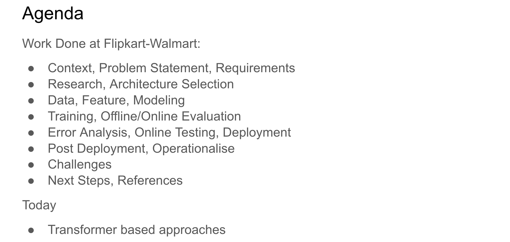
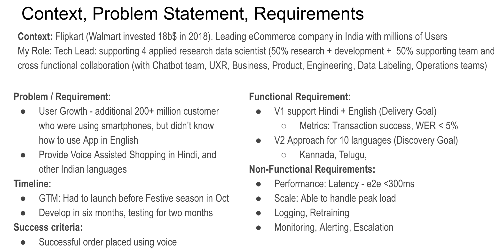
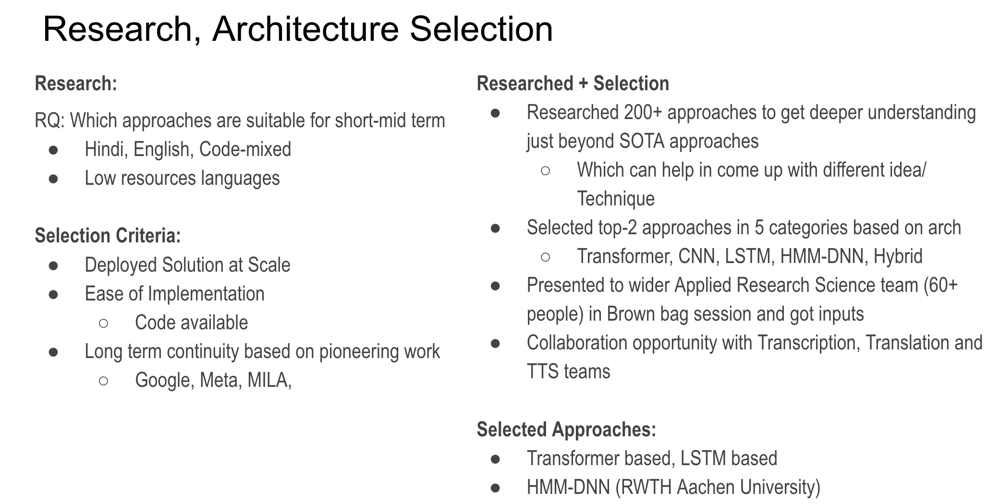
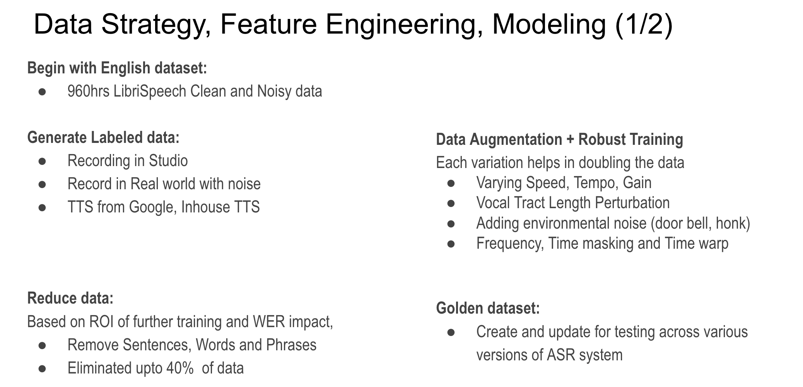
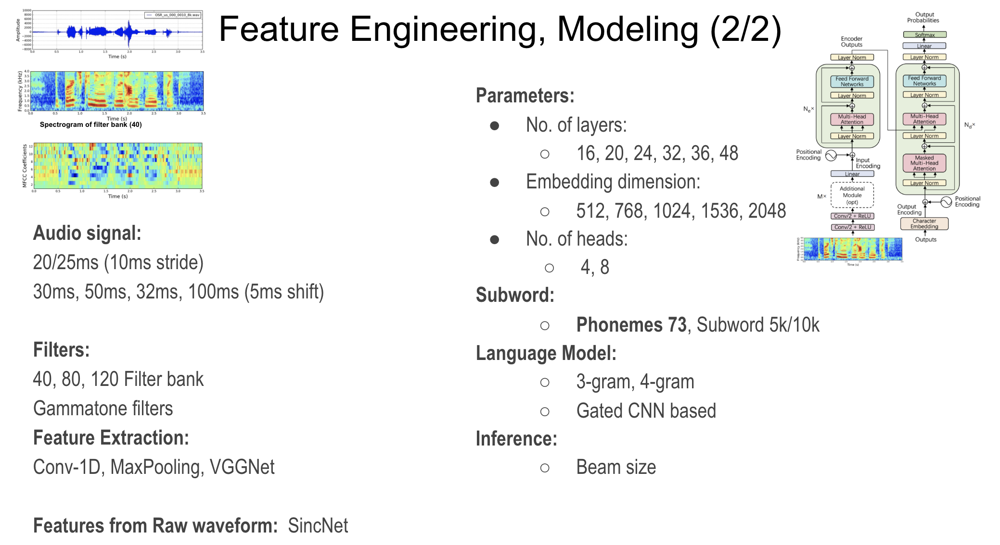
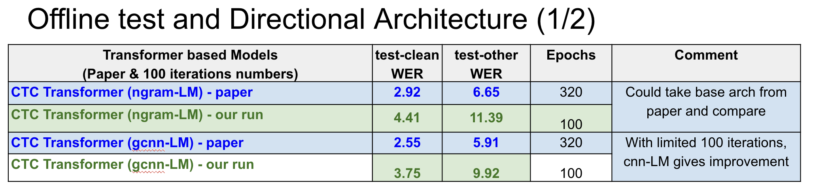
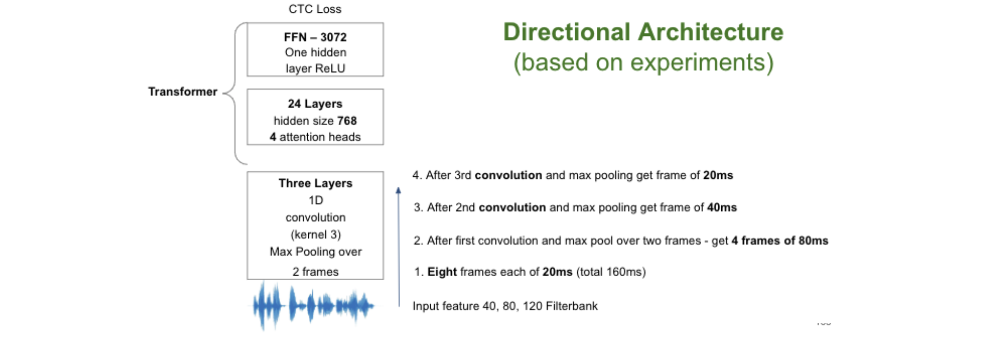
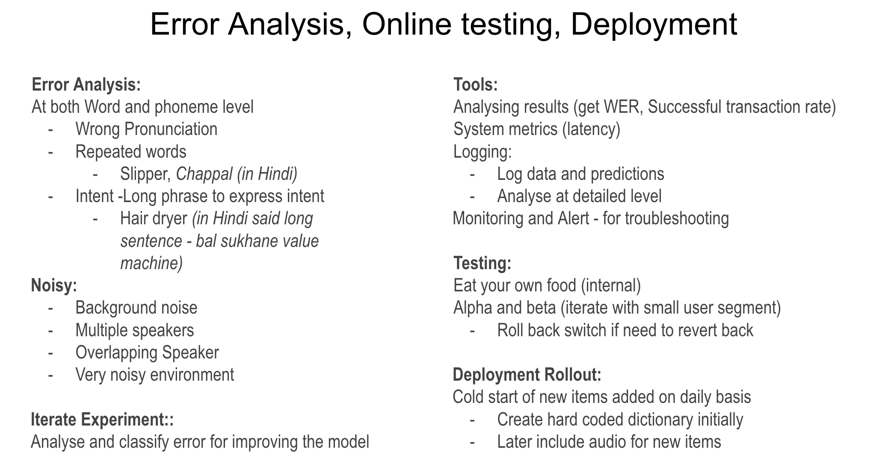
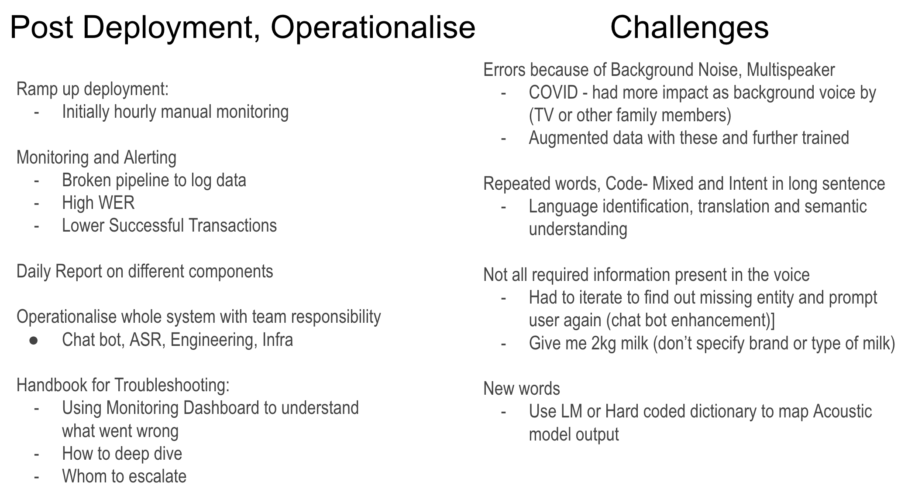
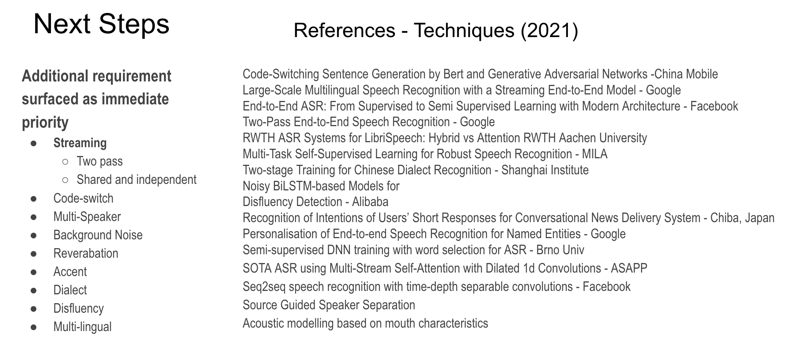
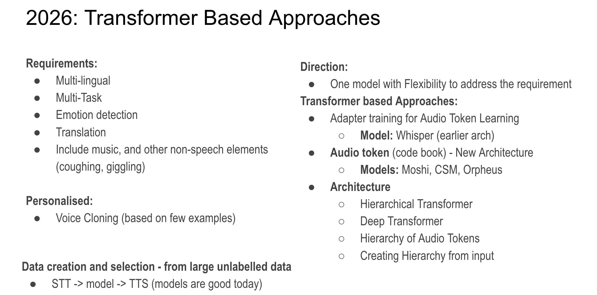

---

om

[Project PDF](https://drive.google.com/your-private-link)

